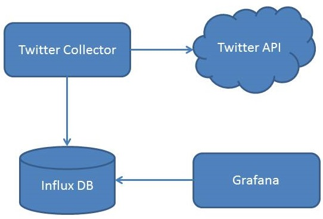

[](http://www.gnu.org/licenses/gpl-3.0)
[](https://travis-ci.org/nt-ca-aqe/marketing-metrics-collector)
[](https://codecov.io/gh/nt-ca-aqe/marketing-metrics-collector)

Marketing metrics collector is a tool to collect information on different kind of medias. It is mainly used for collecting 
information for the IT company NovaTec Consulting GmbH.

### Features

- Picking metrics from medias..
   - Github
   - Twitter
   - Google Analytics - NovaTec Homepage
   - Google Analytics - NovaTec Blog
   - LinkedIn (currently under development)
   - Xing (currently under development)
   - Facebook (planned)
   - Kununu (planned)
- Saving data to influx database. Saved data can be picked up with tools like Grafana to get a more informative view over 
collected data.
- Custom configuration like scheduling collector, retention of influx data and collector specific configurations like authorization. 
- Every configuration data can be picked up from system variables. Sensitive data like passwords or token can be taken from 
local system variable and passed to a docker image. The classic way of saving data to a property file is also possible.
- Every media is a microservice delivered with docker
- Docker compose can be started by a gradle task. Creating and starting docker images manually is all water under the bridge now. 


### Collectors and medias

"media" means the provider of information like Github, Twitter or Google Analytics. The collector is the mechanism which 
fetches information of one media. Mostly there is one collector for each metric. For instance the Tweets collector collects 
the number of tweets of a user. Other Twitter metrics like number of retweets has their own collectors.

The following image describes what the twitter collector basically does:



### Configuration
Probably you don't want to safe (and check-in) your security settings like tokens or private keys into the application.yml. 
These settings can passed by as a system variable to any desired microservice. You can set system variables manually when 
you like to start the collector locally. If you want to use docker, it is necessary to set desired parameters in the 
docker-compose.yml. To avoid accidentally checked in private tokens, the docker-compose will be ignored by git. The metrics 
collector provides a docker-compose.yml-example which contains examples for some properties. You can trim "-example" and use 
your new docker-compose.yml as the basic configuration. Fill in all parameters you get from your provider (GitHub, 
Twitter, ..), add parameters or remove a service. The name of the system variable is equal to the name of the property in
the application.yml.

Example:

mmc-github/src/main/resources/appllication.yml:
```
github:cron:0 * * * * *
```
docker-compose.yml:
```
services:github:environment:GITHUB_CRON=0 * * * * *
```
Note: The colon in a property-key is a underscore in docker-compose 


To configure the marketing metrics collector, the application.yml in every resources-folder has to be configured. When there
is no value(!) for the key, the system variable, specified in docker-compose will be used automatically.


### Start all services
- start all services, specified in docker-compose:
```
./gradlew composeUp
```

- attach yourself to the logs of all running services:
```
docker-compose logs -f -t
```

- stop all running services:
```
./gradlew composeDown
```

Please make sure to have a running docker-machine when using Docker on MacOS or Windows. For more information read the 
[docker-machine documenation](https://docs.docker.com/machine/).

### Issues
If you experience any issues please use GitHub's [issue](https://github.com/nt-ca-aqe/marketing-metrics-collector/issues) 
system to tell us about it!

### Licensing
Metrics Marketing Collector is licensed under [GNU General Public License 3](http://www.gnu.org/licenses/gpl-3.0).

### Sponsoring
Metrics Marketing Collector is mainly developed by [NovaTec Consulting GmbH](http://www.novatec-gmbh.de/), a German 
consultancy firm that drives quality in software development projects.